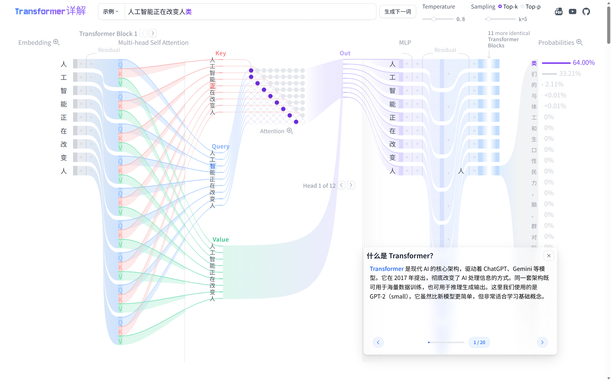

# Transformer Explainer — 中文版

> 基于原项目 [poloclub/transformer-explainer](https://github.com/poloclub/transformer-explainer) 二次开发，将模型替换为中文 GPT-2，并完整适配中文分词、中文示例数据与前端界面。

[](LICENSE)
[](https://github.com/poloclub/transformer-explainer/blob/main/LICENSE)
[](https://www.apache.org/licenses/LICENSE-2.0)



---

## 项目实现了什么

### 核心功能

Transformer Explainer 是一个**交互式 Transformer 可视化工具**，让任何人都能在浏览器中直观理解 GPT 类语言模型的工作原理。

本中文版在原项目基础上，将模型替换为中文 GPT-2（`uer/gpt2-chinese-cluecorpussmall`），实现如下功能：

- **浏览器内中文推理**：无需后端服务器，模型完全在浏览器中通过 ONNX Runtime Web 运行
- **逐 token 可视化**：输入中文文本后，可视化每个 token 经过 Transformer 各层的完整计算过程
- **注意力矩阵可视化**：展示每一层、每个注意力头的 Q/K/V 乘积、缩放、掩码与 Softmax 全过程
- **MLP 子层可视化**：展示前馈网络的线性变换与激活
- **概率分布与采样**：展示最终 logits 经 temperature 缩放、Top-K 过滤、Softmax 归一化后的 token 概率分布，并可视化采样过程
- **内置中文示例**：提供 5 个中文示例 prompt，支持离线演示（无需等待模型加载）
- **可调参数**：支持在界面上调整 temperature 与 Top-K 参数，实时观察对概率分布的影响

### 可视化的 Transformer 组件

| 组件                 | 可视化内容                                    |
| -------------------- | --------------------------------------------- |
| Token Embedding      | 输入 token 映射为词向量                       |
| Positional Encoding  | 位置编码叠加到词向量                          |
| Multi-Head Attention | Q/K/V 投影、缩放点积、掩码、Softmax、加权求和 |
| Add & Norm           | 残差连接与层归一化                            |
| Feed-Forward (MLP)   | 两层线性变换与 GELU 激活                      |
| Linear & Softmax     | 最终 logits 投影与 token 概率输出             |

---

## 如何实现的

### 技术架构

```
浏览器端
  SvelteKit + TypeScript  ← 前端框架
  ONNX Runtime Web        ← 模型推理引擎（WebAssembly）
  D3.js + GSAP            ← 数据可视化与动画
  Tailwind CSS + SCSS     ← 样式

离线构建（Python）
  PyTorch + Transformers  ← 加载 HuggingFace 权重
  torch.onnx.export       ← 导出 ONNX（opset=11）
  onnxruntime             ← 推理验证
  BertTokenizer           ← 中文分词
```

### 模型运行原理

1. Python 脚本将 HuggingFace 中文 GPT-2 权重映射到 nanoGPT 骨架，导出为与前端完全兼容的 ONNX 文件
2. ONNX 文件按 10 MB 切分为多个分片，部署到 `static/` 目录
3. 前端通过 `fetchChunks.js` 并发拉取分片，合并后创建 ONNX Runtime session
4. 用户输入文本后，由 `BertTokenizer`（在浏览器端通过 `tokenizers` 库）分词
5. `data.ts` 执行推理，提取所有注意力中间值和 `linear_output`，分发给各可视化组件

### 关键设计决策

**输出张量命名对齐**：导出的 ONNX 输出名称与原项目完全一致（`block_{i}_attn_head_{j}_{suffix}`），因此所有前端可视化组件无需修改。

**权重映射转置**：HuggingFace GPT-2 的 `c_attn` / `c_proj` / `c_fc` 使用 `Conv1D`（权重形状 `[in, out]`），nanoGPT 使用 `nn.Linear`（形状 `[out, in]`），以下 4 组权重在复制时需要转置：

```
attn.c_attn.weight   attn.c_proj.weight
mlp.c_fc.weight      mlp.c_proj.weight
```

**统一配置源**：Python 脚本与前端共享 `model-config.json`，所有参数（层数、头数、词表大小、分片数、缓存版本等）单一来源，避免手动同步。

---

## 快速开始

模型分片已内置于仓库的 `static/model-v2-chinese/` 目录，克隆后**无需任何 Python 环境**，直接启动前端即可。

**前提条件：** Node.js v20+，NPM v10+

```bash
git clone https://github.com/Y-chen3164553757/transformer-explainer-Chinese.git
cd transformer-explainer-Chinese
npm install
npm run dev
```

访问 `http://localhost:5173`，首次打开时浏览器会自动下载并缓存模型分片，之后刷新无需重新下载。

---

## 我们做了什么 — 中文模型接入流程

原项目使用英文 GPT-2 权重，本版本将其替换为中文 GPT-2（`uer/gpt2-chinese-cluecorpussmall`）。整个过程通过四个离线 Python 脚本完成，产物直接放入仓库供前端使用。

### 四步流程概览

```
model-config.json（唯一配置源，Python 与前端共享）
       │
       ├─── 01.py ──────────────────► models/gpt2-chinese-cluecorpussmall/
       │         从 HuggingFace 下载中文 GPT-2 权重
       │
       ├─── 02_convert_onnx.py ─────► models/gpt2-chinese-onnx/model.onnx
       │         HF 权重 → nanoGPT 骨架 → ONNX 导出（opset=11，~460 MB）
       │
       ├─── 03_chunk.py ────────────► static/model-v2-chinese/gpt2.onnx.part0~45
       │         按 10 MB 切片，供浏览器并发加载
       │
       └─── 04_gen_examples.py ─────► src/constants/examples/ex0~ex4.js
                对 5 个中文提示词跑推理，生成前端离线示例数据
```

| 步骤 | 脚本                   | 核心操作                                                                                                                                                                                           | 输出                                           |
| :--: | ---------------------- | -------------------------------------------------------------------------------------------------------------------------------------------------------------------------------------------------- | ---------------------------------------------- |
|  1  | `01.py`              | `snapshot_download` 从 HF 拉取权重，跳过 msgpack/h5 等非 PyTorch 文件                                                                                                                            | `models/gpt2-chinese-cluecorpussmall/`       |
|  2  | `02_convert_onnx.py` | 加载 HF `GPT2LMHeadModel` → 映射到 nanoGPT `Linear`（4 组 `Conv1D` 权重需转置）→ 自定义 wrapper 抽取全部 attention 中间值 → `torch.onnx.export` opset=11，用 `BertTokenizer` 验证推理 | `models/gpt2-chinese-onnx/model.onnx`        |
|  3  | `03_chunk.py`        | 按 `chunkSizeBytes`（10 MB）顺序切分，实际分片数与 `chunkTotal` 核对，不一致时打印警告                                                                                                         | `static/model-v2-chinese/gpt2.onnx.part0~45` |
|  4  | `04_gen_examples.py` | 对 `examples` 中 5 个提示词跑 ONNX 推理，按 temperature + top-K 采样，序列化为前端可直接 import 的 JS 对象                                                                                       | `src/constants/examples/ex0~ex4.js`          |

### 关键细节

**权重转置**：HuggingFace GPT-2 的 `c_attn` / `c_proj` / `c_fc` 使用 `Conv1D`（形状 `[in, out]`），nanoGPT 使用 `nn.Linear`（形状 `[out, in]`），以下 4 组权重复制时需要 `.t()`：

```
attn.c_attn.weight   attn.c_proj.weight
mlp.c_fc.weight      mlp.c_proj.weight
```

`lm_head.weight` 与词嵌入 `wte.weight` 权重共享，HF checkpoint 中不单独存储，脚本自动从 `transformer.wte.weight` 复制。

**输出张量命名对齐**：导出的 ONNX 输出名称与原项目完全一致（`block_{i}_attn_head_{j}_{suffix}`），所有前端可视化组件无需修改。

**采样逻辑对齐**（`04_gen_examples.py` ↔ 前端 `topKSampling`）：

1. logits 按值降序取前 `maxDisplayTokens`（50）个
2. 温度缩放：`scaledLogit = logit / temperature`（默认 0.8）
3. Top-K 过滤：rank ≥ K 的 `topKLogit` 置为 `-Infinity`
4. 对 top-K 做 softmax → 归一化概率
5. 固定随机种子（`sampleSeed = 42`）从 top-K 中采样，保证可复现

---

## 模型来源与原始权重

| 资源                           | 地址                                                    |
| ------------------------------ | ------------------------------------------------------- |
| 中文 GPT-2 权重（HuggingFace） | https://huggingface.co/uer/gpt2-chinese-cluecorpussmall |
| Tokenizer（bert-base-chinese） | https://huggingface.co/google-bert/bert-base-chinese    |

---

## 若需重新生成模型资产

若需更换模型或重新生成分片，安装 Python 依赖后按顺序执行四个脚本：

```bash
pip install torch transformers onnxruntime huggingface_hub

python 01.py                # 下载中文 GPT-2 权重
python 02_convert_onnx.py   # 转换为 ONNX 并验证推理
python 03_chunk.py          # 分片到浏览器静态目录
python 04_gen_examples.py   # 生成 5 个中文示例数据
```

---

## 共享配置说明（model-config.json）

| 字段                     | 含义                              | 默认值                               |
| ------------------------ | --------------------------------- | ------------------------------------ |
| `modelId`              | HuggingFace 模型 ID               | `uer/gpt2-chinese-cluecorpussmall` |
| `tokenizerId`          | 使用的 tokenizer                  | `bert-base-chinese`                |
| `hfMirror`             | HuggingFace 镜像源地址            | `https://hf-mirror.com`            |
| `paths.staticModelDir` | 分片文件写入目录（Python 脚本用） | `static/model-v2-chinese`          |
| `paths.publicModelDir` | 前端请求分片的 URL 前缀           | `model-v2-chinese`                 |
| `runtime.chunkTotal`   | 分片总数，前端与 Python 共享      | `46`                               |
| `runtime.cacheVersion` | 浏览器缓存版本键，升级模型时递增  | `v3`                               |

---

## 目录结构

```
transformer-explainer/
├── model-config.json          # 唯一配置源（Python + 前端共享）
├── 01.py                      # Step 1: 下载模型权重
├── 02_convert_onnx.py         # Step 2: 转换 ONNX
├── 03_chunk.py                # Step 3: 分片
├── 04_gen_examples.py         # Step 4: 生成示例数据
├── src/
│   ├── routes/                # SvelteKit 页面入口
│   ├── components/            # 可视化组件
│   ├── store/                 # 全局状态（读取 model-config.json）
│   ├── constants/examples/    # ex0~ex4.js 示例数据（由 04.py 生成）
│   └── utils/model/           # nanoGPT 模型骨架（model.py）
├── static/
│   ├── model-v2-chinese/      # 模型分片（46 个，已内置于仓库）
│   └── tokenizers/            # bert-base-chinese tokenizer 配置
└── models/                    # 本地权重与 ONNX 中间文件（不上传 Git）
```

---

## 致谢

本项目基于以下两个开源项目构建，向原作者致谢：

**[poloclub/transformer-explainer](https://github.com/poloclub/transformer-explainer)**
由 Georgia Institute of Technology 的 Aeree Cho、Grace C. Kim、Alexander Karpekov、Alec Helbling、Jay Wang、Seongmin Lee、Benjamin Hoover 和 Polo Chau 创作。本项目的前端可视化框架、ONNX 推理管线和交互设计均来源于此。发表于 IEEE VIS 2024。授权协议：MIT License。

**[uer/gpt2-chinese-cluecorpussmall](https://huggingface.co/uer/gpt2-chinese-cluecorpussmall)**
由 Universal Language Model Fine-tuning（UER）团队开源的中文 GPT-2 模型，在 CLUECorpusSmall 数据集上训练，词表大小 21128，12 层 12 头 768 维。本项目使用其权重作为中文推理引擎。授权协议：Apache License 2.0。

---

## License

| Component                                                                                                | License                                                                         |
| -------------------------------------------------------------------------------------------------------- | ------------------------------------------------------------------------------- |
| This project (source code, scripts, docs)                                                                | Proprietary — see[LICENSE](LICENSE)                                               |
| [poloclub/transformer-explainer](https://github.com/poloclub/transformer-explainer)                         | [MIT License](https://github.com/poloclub/transformer-explainer/blob/main/LICENSE) |
| [uer/gpt2-chinese-cluecorpussmall](https://huggingface.co/uer/gpt2-chinese-cluecorpussmall) (model weights) | [Apache License 2.0](https://www.apache.org/licenses/LICENSE-2.0)                  |

The original adaptations, engineering modifications, and new features created by the author are independent original works. Redistribution of the Chinese GPT-2 model weights must comply with the Apache License 2.0.
