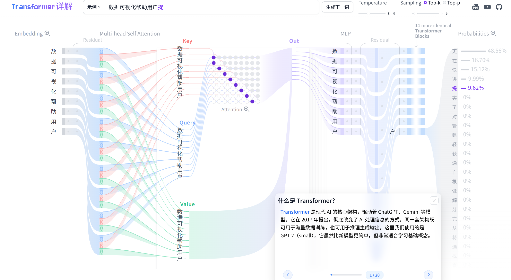

# Transformer Explainer 中文版

基于中文 GPT-2 的 Transformer 交互式可视化工具，支持中文输入、逐 token 推理与注意力矩阵可视化。



---

## ⚠️ 模型文件已删除 — 重新拉取说明

仓库中 `static/model-v2-chinese/` 下的模型分片及 `models/` 下的本地权重**均未提交至 Git**（体积过大）。若本地文件丢失，需按以下步骤重新生成。

### 1. 安装 Python 依赖

```bash
pip install torch transformers onnxruntime huggingface_hub
```

### 2. 配置代理 / 镜像（二选一）

**方式 A — 修改代理（若有科学上网）**

编辑项目根目录的 `model-config.json`，将 `proxy` 字段改为本地代理地址：

```jsonc
"proxy": {
  "http":  "http://127.0.0.1:你的端口",
  "https": "http://127.0.0.1:你的端口"
}
```

不需要代理时，将两个值置空 `""`。

**方式 B — 直接使用镜像源（无需代理）**

`model-config.json` 中 `hfMirror` 已内置 `https://hf-mirror.com`，在网络可达的情况下无需任何修改，直接运行下一步即可。

### 3. 依次运行四个脚本

```bash
python 01.py                # 下载中文 GPT-2 权重
python 02_convert_onnx.py   # 转换为 ONNX 并验证推理
python 03_chunk.py          # 分片到浏览器静态目录
python 04_gen_examples.py   # 生成 5 个中文示例数据
```

> 全部完成后，再进行下方"快速开始"中的前端启动。

---

## 四步流程说明

所有脚本均读取根目录 `model-config.json` 作为**唯一配置源**，无需手动修改脚本内部参数。

```
model-config.json
       │
       ├─── 01.py ──────────────────► models/gpt2-chinese-cluecorpussmall/
       │         snapshot_download         (PyTorch 权重 + config.json)
       │
       ├─── 02_convert_onnx.py ─────► models/gpt2-chinese-onnx/model.onnx
       │         HF → nanoGPT 骨架         (~460 MB, opset=11)
       │         权重映射 + ONNX 导出
       │
       ├─── 03_chunk.py ────────────► static/model-v2-chinese/gpt2.onnx.part0~45
       │         按 10 MB 分片              (浏览器可并发加载)
       │
       └─── 04_gen_examples.py ─────► src/constants/examples/ex0~ex4.js
                ONNX 推理 × 5 提示词       (前端离线示例数据)
```

| 步骤 | 脚本 | 核心操作 | 输出 |
|:---:|---|---|---|
| 1 | `01.py` | `snapshot_download` 从 HF / 镜像拉取权重，跳过 msgpack/h5 等非 PyTorch 文件 | `models/gpt2-chinese-cluecorpussmall/` |
| 2 | `02_convert_onnx.py` | 加载 HF `GPT2LMHeadModel` → 映射到 nanoGPT `Linear`（4 组 `Conv1D` 权重需转置）→ 自定义 wrapper 抽取全部 attention 中间值 → `torch.onnx.export` opset=11，随后用 `BertTokenizer` 验证推理 | `models/gpt2-chinese-onnx/model.onnx` |
| 3 | `03_chunk.py` | 按 `chunkSizeBytes`（10 MB）顺序读写，输出 `gpt2.onnx.part{i}`，实际分片数与 `chunkTotal` 核对，不匹配时打印警告 | `static/model-v2-chinese/gpt2.onnx.part0~45` |
| 4 | `04_gen_examples.py` | 对 `examples` 中 5 个提示词跑 ONNX 推理，按 temperature + top-K 采样，序列化为前端可直接 import 的 JS 对象（含 logits / attention / probabilities / sampled） | `src/constants/examples/ex0~ex4.js` |

### Step 2 关键细节：权重映射

HuggingFace GPT-2 的 `c_attn` / `c_proj` / `c_fc` 使用 `Conv1D`（权重形状为 `[in, out]`），而 nanoGPT 使用 `nn.Linear`（形状为 `[out, in]`），因此下列 4 类权重在复制时需要**转置**（`.t()`）：

```
attn.c_attn.weight  attn.c_proj.weight
mlp.c_fc.weight     mlp.c_proj.weight
```

`lm_head.weight` 与词嵌入 `wte.weight` 共享，HF checkpoint 中不单独存储，脚本会自动从 `transformer.wte.weight` 复制。

### Step 4 采样逻辑

与前端 `topKSampling` 保持完全一致，避免示例数据与在线推理结果不符：

1. 取 logits 按值降序，截取前 `maxDisplayTokens`（50）个
2. 温度缩放：`scaledLogit = logit / temperature`（温度默认 0.8）
3. Top-K 过滤：rank ≥ K 的 `topKLogit` 置为 `-Infinity`
4. 对 top-K 做 softmax → 归一化概率
5. 用固定随机种子（`sampleSeed = 42`）从 top-K 中采样，保证可复现

---

## 快速开始

### 路径 A — 模型文件已丢失（首次或重建）

```bash
# 1. 重新生成模型资产（见上方"重新拉取说明"）
python 01.py
python 02_convert_onnx.py
python 03_chunk.py
python 04_gen_examples.py

# 2. 启动前端
npm install
npm run dev
```

### 路径 B — 模型分片已存在于 static/model-v2-chinese/

```bash
npm install
npm run dev
```

访问 `http://localhost:5173`，首次加载时浏览器会自动下载并缓存模型。

---

## 共享配置说明（model-config.json）

| 字段 | 含义 | 默认值 |
|---|---|---|
| `modelId` | HuggingFace 模型 ID | `uer/gpt2-chinese-cluecorpussmall` |
| `tokenizerId` | 使用的 tokenizer | `bert-base-chinese` |
| `hfMirror` | HuggingFace 镜像源地址 | `https://hf-mirror.com` |
| `proxy.http` / `proxy.https` | Python 下载代理，不需要时置空 `""` | `http://127.0.0.1:10808` |
| `paths.staticModelDir` | 分片文件写入目录（Python 脚本用） | `static/model-v2-chinese` |
| `paths.publicModelDir` | 前端请求分片的 URL 前缀 | `model-v2-chinese` |
| `runtime.chunkTotal` | 分片总数，前端与 Python 共享 | `46` |
| `runtime.cacheVersion` | 浏览器缓存版本键，升级模型时递增 | `v3` |

---

## 主要特性

- 支持中文 GPT-2（`uer/gpt2-chinese-cluecorpussmall`）推理与逐 token 可视化
- 全界面中文化，适配中文分词与字符显示
- 保留原项目全部交互能力：注意力矩阵、QKV、MLP、残差、Softmax 可视化
- 示例数据、tokenizer、模型分片均已适配中文
- Python 流水线与前端共享 `model-config.json`，参数单一来源

---

## 目录结构

```
transformer-explainer/
├── model-config.json          # 唯一配置源（Python + 前端共享）
├── 01.py                      # Step 1: 下载模型权重
├── 02_convert_onnx.py         # Step 2: 转换 ONNX
├── 03_chunk.py                # Step 3: 分片
├── 04_gen_examples.py         # Step 4: 生成示例数据
├── src/
│   ├── routes/                # SvelteKit 页面入口
│   ├── components/            # 可视化组件
│   ├── store/                 # 全局状态（读取 model-config.json）
│   ├── constants/examples/    # ex0~ex4.js 示例数据（由 04.py 生成）
│   └── utils/model/           # nanoGPT 模型骨架（model.py）
├── static/
│   ├── model-v2-chinese/      # 模型分片（由 03.py 生成，不上传 Git）
│   └── tokenizers/            # bert-base-chinese tokenizer 配置
└── models/                    # 本地权重与 ONNX 中间文件（不上传 Git）
```

---

## 协议声明

本项目为私有协议，著作权归本人所有，禁止任何第三方在未获授权情况下复制、分发、商用。

**合规声明：** 本项目部分代码和模型基于以下开源项目，均遵循 MIT License：
- 原项目：[poloclub/transformer-explainer](https://github.com/poloclub/transformer-explainer)
- 中文模型：[uer/gpt2-chinese-cluecorpussmall](https://huggingface.co/uer/gpt2-chinese-cluecorpussmall)

本地化、重构与新增部分版权归 Y-chen3164553757 所有。
